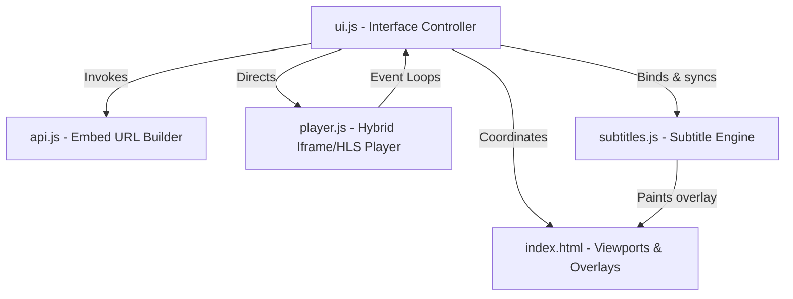
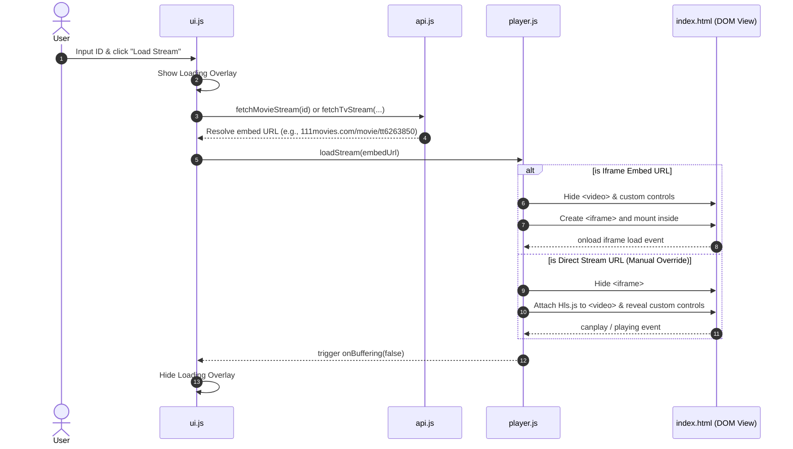

# System Architecture - 605streams Personal Streaming Client

This document outlines the modular structure, components, data flows, and performance considerations of the **605streams** web client.

---

## 1. Design Overview
The client is structured as a **Vanilla JS Single Page Application (SPA)** with zero build steps, compiler tooling, or backend dependencies. By adopting standard ES Modules (`import`/`export`), the application maintains strict modularity, high performance, and rapid client-side updates.

It features a **Hybrid Player Engine** capable of toggling between standard secure iframe embeds and native HTML5/Hls.js streaming elements depending on the resource protocol loaded.

---

## 2. Modular Component Breakdown

### A. Core Entry (`app.js`)
* **Role**: App bootstrapper.
* **Responsibilities**:
  * Listens for `DOMContentLoaded`.
  * Calls `initUI()` in the UI controller.
  * Catches and reports critical startup crashes.

### B. UI Engine (`ui.js`)
* **Role**: Primary orchestrator and event binder.
* **Responsibilities**:
  * Binds DOM form components (Movie/TV toggle, Season/Episode expander).
  * Hooks up manual bypass overrides (apply, clear, status displays, and automated reload triggers).
  * Directs visual screens (loading spinner overlays, playback error panels, connection indicator).
  * Governs subtitle uploads, delay shifts, and sync downloads.

### C. API Gateway (`api.js`)
* **Role**: Embed URL constructor.
* **Responsibilities**:
  * Maps content IDs directly to `https://111movies.com/movie/{id}` and `https://111movies.com/tv/{id}/{season}/{episode}`.
  * Bypasses heavy fetching loops, raw body string extractions, and CORS proxies entirely to guarantee 100% stable loads.
  * Exposes global diagnostic testing methods (e.g. `API.setDebug()`, `API.setManualStreamUrl()`).

### D. Media Player (`player.js`)
* **Role**: Hybrid viewport orchestrator.
* **Responsibilities**:
  * **Iframe Embed Mode**: Instantiates a secure sandbox `<iframe>` loading `111movies.com` widgets directly. Swaps viewport displays and hides custom controls/subtitles (relying on high-quality built-in player controls).
  * **Direct Video Mode**: Active when playing manual overrides (`.m3u8`, `.mp4`). Integrates `Hls.js` decoders, binds custom timeline progress ranges, skips intervals, volumes, and overlays synced subtitle cue cards.
  * Governs fullscreen bindings on the *outer container element* to keep subtitles positioned correctly during fullscreen media consumption.

### E. Subtitle Engine (`subtitles.js`)
* **Role**: Time-accurate subtitle parser and synchronization shifter.
* **Responsibilities**:
  * Active during direct video playback.
  * Parses standard `.srt` or `.vtt` raw files into memory.
  * Strips visual cluttering HTML tags (like `<i>`, `<b>`, `<c>`).
  * Performs fast cue lookups upon `timeupdate` changes against the offset equation: `adjustedTime = currentTime + subtitleOffset`.
  * Renders active subtitles onto an absolute glassmorphic overlay div.
  * Generates timing-shifted `.srt` compiled files for local sync exporting.

---

## 3. Data & Playback Flow

The sequence diagram below describes the interaction flow from the moment a user selects a video.

---

## 4. Key Performance Optimizations

1. **Zero CORS Overheads**: Standard content streams bypass standard browser requests and external proxy fallbacks, ensuring instant, zero-delay loadtimes.
2. **Buffer and Decoder Isolation**: Hls.js decoders and event logs are strictly unmounted and garbage-collected whenever transitioning to iframe modes, optimizing CPU cycles.
3. **Responsive Viewport Constraints**: The iframe container utilizes absolute aspect-ratio styling rules ensuring fluid fits on both desktop layouts and mobile viewports.