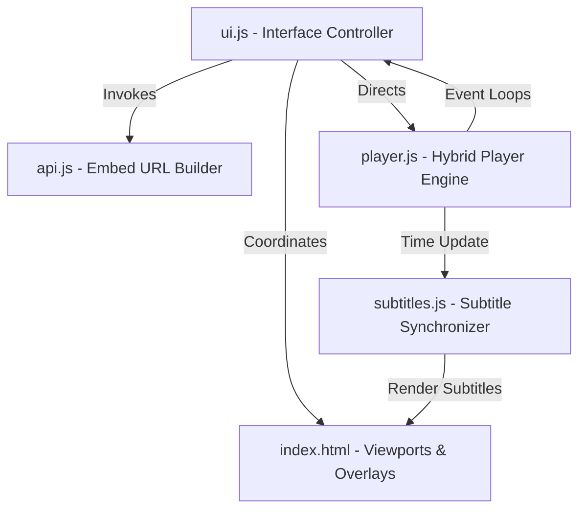
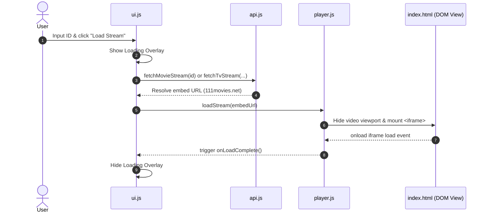
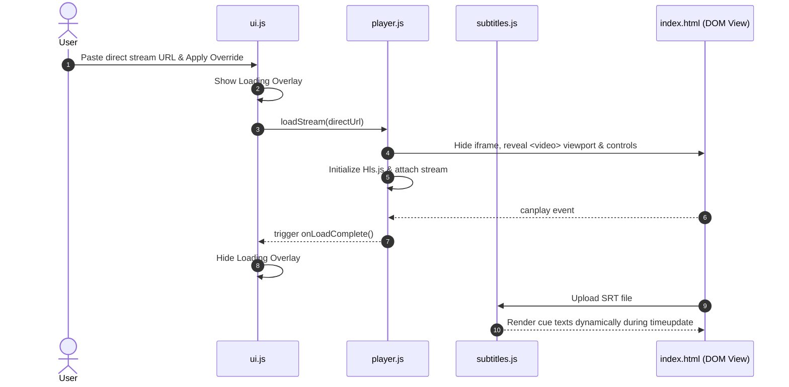

# System Architecture - 605streams Personal Streaming Client

This document outlines the modular structure, components, data flows, and performance considerations of the dual-mode **605streams** web client.

---

## 1. Design Overview
The client is structured as a **Vanilla JS Single Page Application (SPA)** with zero build steps, compiler tooling, or backend dependencies. By adopting standard ES Modules (`import`/`export`), the application maintains strict modularity, high performance, and rapid client-side updates.

It features a **Dual-Mode Hybrid Player Engine** capable of loading secure sandboxed iframe embeds (Mode 1) or decoding direct HLS/MP4 manual overrides with in-memory local subtitles sync shifting (Mode 2).

---

## 2. Modular Component Breakdown

### A. Core Entry (`app.js`)
* **Role**: App bootstrapper.
* **Responsibilities**:
  * Listens for `DOMContentLoaded`.
  * Calls `initUI()` in the UI controller.

### B. UI Engine (`ui.js`)
* **Role**: Primary orchestrator and event binder.
* **Responsibilities**:
  * Binds DOM form components (Movie/TV toggle, Season/Episode expander).
  * Connects subtitle uploads, delay shifts sliders, download adjustments, and hotkeys.
  * Directs visual loading spinner overlays and error screens.

### C. API Gateway (`api.js`)
* **Role**: Embed URL constructor.
* **Responsibilities**:
  * Maps content IDs directly to `https://111movies.net/movie/{id}` and `https://111movies.net/tv/{id}/{season}/{episode}`.
  * Resolves manual overrides and exposes global namespaces (`window.API`) for console testing.

### D. Media Player (`player.js`)
* **Role**: Playback engine.
* **Responsibilities**:
  * Mode 1: Mounts secure sandboxed `<iframe>` elements to bypass CORS limitations.
  * Mode 2: Boots Hls.js or HTML5 native media handlers to process manual overrides.
  * Coordinates loading overlays via canplay, onload, and buffering events.

### E. Subtitle Manager (`subtitles.js`)
* **Role**: In-memory cue indexer and timing shifter.
* **Responsibilities**:
  * Parses VTT/SRT files into timing objects.
  * Performs millisecond-accurate sync shifting (-10.0s to +10.0s).
  * Renders floating overlays over native video viewports and exports adjusted timing `.srt` downloads.

---

## 3. Data & Playback Flow

### Standard Movie/Show Play (Mode 1)

### Direct Video Override Play (Mode 2)

---

## 4. Key Performance Optimizations

1. **Lazy Loading Decoder**: Hls.js is loaded dynamically and fully disposed of on stream changes to optimize memory footprints.
2. **Class-Based Toggle**: State loading uses class lists to trigger hardware-accelerated GPU animations rather than layout-heavy inline CSS styles.
3. **Linear Cue Lookup**: Search cue arrays are pre-sorted during import to allow ultra-fast visual rendering (<2ms lookup frames).