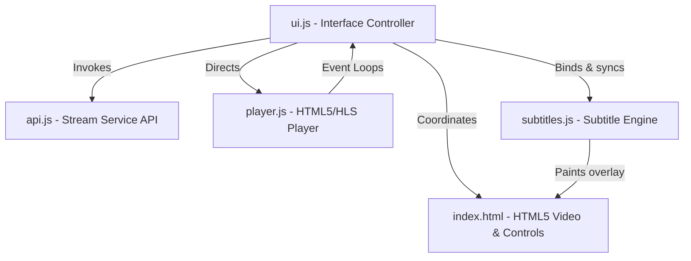
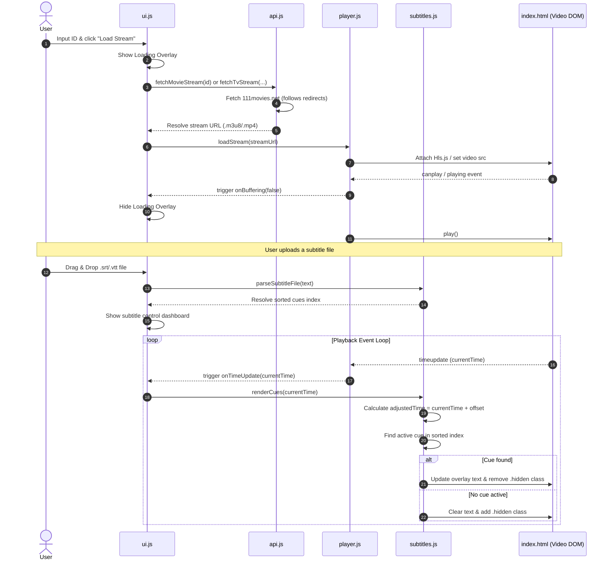

# System Architecture - 605streams Personal Streaming Client

This document outlines the modular structure, components, data flows, and performance considerations of the **605streams** web client.

---

## 1. Design Overview
The client is structured as a **Vanilla JS Single Page Application (SPA)** with zero build steps, compiler tooling, or backend dependencies. By adopting standard ES Modules (`import`/`export`), the application maintains strict modularity, high performance, and rapid client-side updates.

---

## 2. Modular Component Breakdown

### A. Core Entry (`app.js`)
* **Role**: App bootstrapper.
* **Responsibilities**:
  * Listens for `DOMContentLoaded`.
  * Calls `initUI()` in the UI controller.
  * Catches and reports critical startup crashes.

### B. UI Engine (`ui.js`)
* **Role**: Primary orchestrator and event binder.
* **Responsibilities**:
  * Binds DOM form components (Movie/TV toggle, Season/Episode expander).
  * Hooks up custom HTML5 media controls (Play/Pause, custom range scrubbers, Volume sliders, fullscreen triggers).
  * Directs visual screens (loading spinner, playback error panels, connection indicator).
  * Listens for system keyboard shortcuts.
  * Manages controls idle-inactivity fading (fade out controls after 3 seconds of active playback).

### C. API Gateway (`api.js`)
* **Role**: 111Movies service network connector.
* **Responsibilities**:
  * Formulates REST HTTP requests to `https://111movies.net/movie/{id}` and `https://111movies.net/tv/{id}/{season}/{episode}`.
  * Extracts playback URLs from 111Movies via HTTP Redirect following (`response.url`) or parsing string response body / JSON payload fields (`url`, `stream`, `src`, `file`).
  * Validates and returns streamable `.m3u8` or `.mp4` URLs.
  * Catches HTTP error statuses (400, 404, 500) and bubble up descriptive network errors.

### D. Media Player (`player.js`)
* **Role**: Video engine and HLS stream driver.
* **Responsibilities**:
  * Wraps HTML5 `<video>` element behaviors.
  * Dynamically instances `Hls.js` for `.m3u8` playlist loading in browsers lacking native support (Chrome, Firefox).
  * Recovers gracefully from fatal HLS network/media decoder buffer errors.
  * Triggers event loop callbacks (`onTimeUpdate`, `onDurationChange`, `onBufferProgress`, `onBuffering`, `onStateChange`) back to the UI.
  * Governs fullscreen bindings on the *outer container element* to keep custom elements positioned correctly during full-screen media consumption.

### E. Subtitle Engine (`subtitles.js`)
* **Role**: Time-accurate subtitle parser and synchronization shifter.
* **Responsibilities**:
  * Parses standard `.srt` or `.vtt` raw files into memory.
  * Strips visual cluttering HTML tags (like `<i>`, `<b>`, `<c>`).
  * Maintains an in-memory sorted queue index of subtitle cues (`{ id, start, end, text }`).
  * Performs fast cue lookups upon `timeupdate` changes against the offset equation: `adjustedTime = currentTime + subtitleOffset`.
  * Renders active subtitles onto an absolute glassmorphic overlay div.
  * Generates on-the-fly adjusted `.srt` string files incorporating the offset shifting and initiates standard downloads.

---

## 3. Data & Playback Flow

The sequence diagram below describes the interaction flow from the moment a user selects a video to the continuous video rendering loop with subtitles.

---

## 4. Key Performance Optimizations

1. **Minimized Reflows & DOM Thrashing**: The Subtitle Engine tracks the current active cue ID and only updates the `.innerText` of the overlay container when the cue actually changes.
2. **Memory Leak Protection**: In `player.js`, before loading any new stream, the active Hls.js instance is forcefully detached and destroyed to free up underlying media decoders and buffer caches.
3. **Smooth Timeline Scrubbing**: Visual progress bar updates are decoupled from video scrubbing. When a user drags the progress bar, visual elements update at 60fps immediately, and the heavy video seeking triggers only once the user releases the slider handle.
4. **Binary-Search-Ready Indexes**: Subtitle cues are automatically sorted chronologically on upload, ensuring stable rendering lookups even for long 3-hour movies containing thousands of dialogue cues.